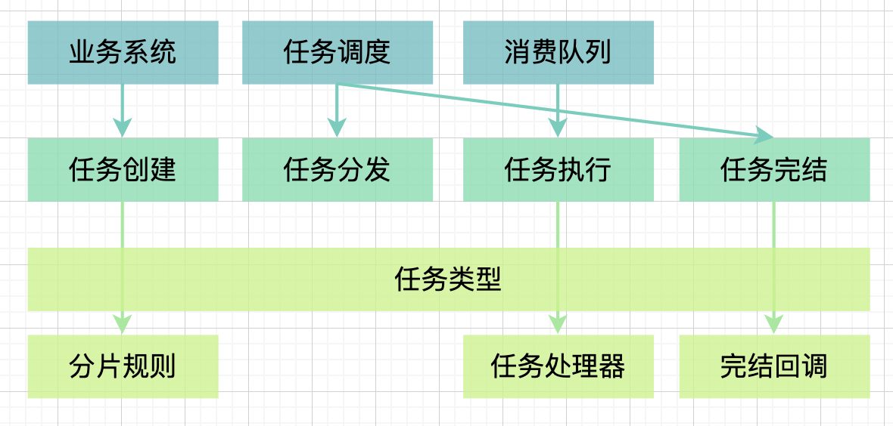
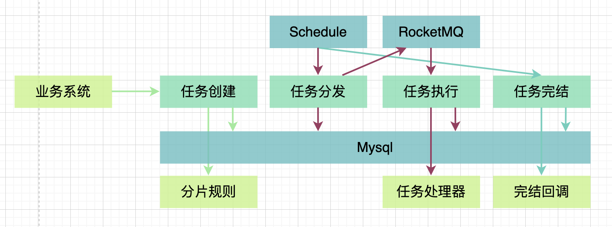
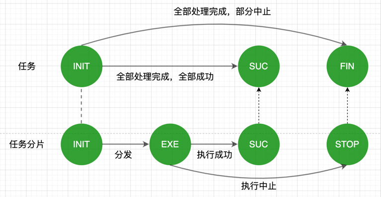

## 介绍
该框架用于分布式环境下批量任务分发处理

主要功能：
```
1.业务系统提供分片规则，创建任务
2.任务分发，由框架完成
3.执行任务，回调业务任务处理器
4.任务完结，回调业务完结处理器
```

特色功能：
```
任务分发，可用于集群下多机器处理任务分片
任务可视，基于Mysql数据库的任务管理
```

依赖的技术有：
```
Mysql
RocketMQ
Spring（当前未从项目拆离）
Schedule（当前还未集成，需要业务系统手动调度）
```
## 架构
### 系统架构

### 技术架构

### 状态机


## 快速开始
### 1.确定任务类型
实现`TaskTypeEnum`接口，通过枚举类维护不同的任务类型
```
@AllArgsConstructor
public enum MyTaskTypeEnum implements TaskTypeEnum {
    TYPE1(0), TYPE2(1);

    private final int type;

    @Override
    public Integer getType() {
        return type;
    }
}
```

### 2.实现任务策略
实现`TaskStrategy`接口，实现以下功能
- 返回任务类型
- 提供任务分片规则
- 提供业务处理逻辑
- 提供任务完结回调
 
```
@Service
public class MyTaskStrategy implements TaskStrategy {
...
}
```
#### 3.配置MQ资源
生产者跟消费者的topic需要对应
```
rocketmq.name-server=127.0.0.1:9876
rocketmq.producer.topic=my_topic
rocketmq.producer.group=my_group

rocketmq.consumer.topic=my_topic
rocketmq.consumer.group=my_group
```
#### 4.创建任务
```
@SpringBootTest(classes = BatchTaskApplication.class)
class BatchTaskApplicationTests {
    @Resource
    private TaskApi taskClient;

    @Test
    public void testCreateTask() {
        taskClient.submit(MyTaskTypeEnum.TYPE1, new Date(), String.valueOf(new Random().nextInt(100000)));
    }
}
```
#### 5.手动调度
当前没有集成调度工具，可通过公司技术栈的分布式调度框架完成。
当前手动调度示范：
```
@SpringBootTest(classes = BatchTaskApplication.class)
class BatchTaskApplicationTests {
    @Resource
    private TaskService taskService;

    @Test
    public void testSchedule() {
        taskService.dispatch();
        taskService.finalization();        
    }
}
```