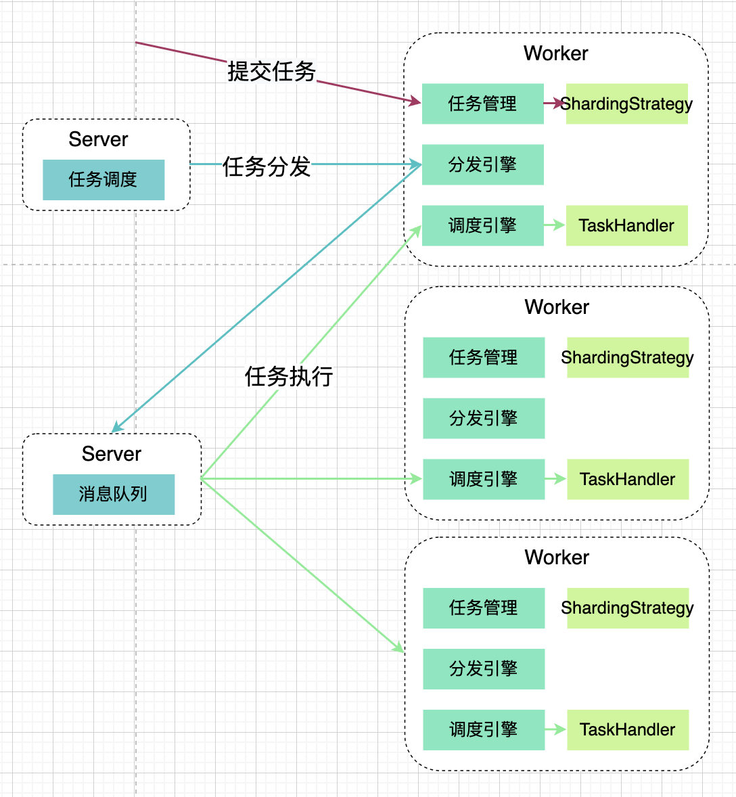
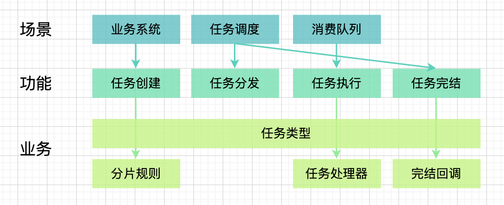
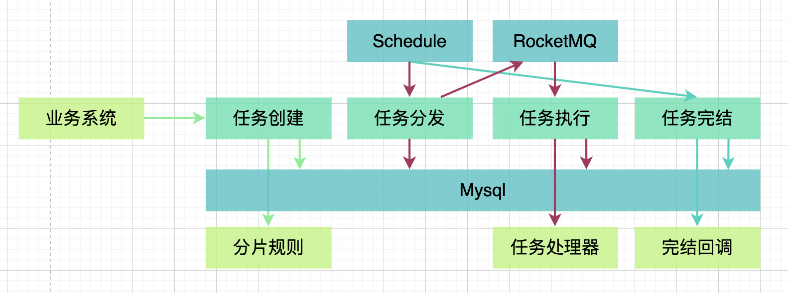
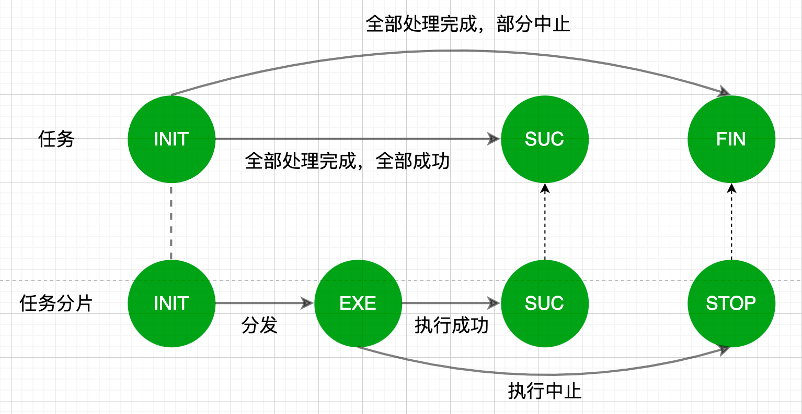

## 介绍
该框架用于分布式环境下批量任务分发处理

InfoQ文章：[分布式任务批处理技术选型与实践](https://xie.infoq.cn/article/7ecb2f26d6c0b6f000af6994f)

主要功能：
```
1.业务系统提供分片规则，创建任务
2.任务分发，由框架完成
3.执行任务，回调业务任务处理器
4.任务完结，回调业务完结处理器
```

特性功能：
```
任务分发，可用于集群下多机器处理任务分片
任务可视，基于Mysql数据库的任务管理
```

依赖的技术有：
```
Mysql
RocketMQ
Spring（当前未从项目拆离）
Schedule（当前还未集成，需要业务系统手动调度）
```
## 架构
### 部署架构

### 系统架构

### 技术架构

### 状态机


## 快速开始
### 0.准备数据库
```
CREATE TABLE `task` (
  `id` bigint unsigned NOT NULL AUTO_INCREMENT,
  `status` varchar(10) CHARACTER SET utf8mb4 COLLATE utf8mb4_0900_ai_ci NOT NULL,
  `create_time` datetime NOT NULL,
  `update_time` datetime NOT NULL ON UPDATE CURRENT_TIMESTAMP,
  `task_type` int NOT NULL,
  `task_time` datetime NOT NULL,
  `biz_data` varchar(1000) DEFAULT NULL,
  PRIMARY KEY (`id`)
) ENGINE=InnoDB AUTO_INCREMENT=13 DEFAULT CHARSET=utf8mb4 COLLATE=utf8mb4_0900_ai_ci;

CREATE TABLE `task_split` (
  `id` bigint unsigned NOT NULL AUTO_INCREMENT,
  `task_id` bigint NOT NULL,
  `status` varchar(10) CHARACTER SET utf8mb4 COLLATE utf8mb4_0900_ai_ci NOT NULL,
  `create_time` datetime NOT NULL,
  `update_time` datetime NOT NULL ON UPDATE CURRENT_TIMESTAMP,
  `task_type` int NOT NULL,
  `task_time` datetime NOT NULL,
  `exec_count` bigint NOT NULL DEFAULT '0',
  `biz_data` varchar(1000) CHARACTER SET utf8mb4 COLLATE utf8mb4_0900_ai_ci DEFAULT NULL,
  PRIMARY KEY (`id`)
) ENGINE=InnoDB AUTO_INCREMENT=618 DEFAULT CHARSET=utf8mb4 COLLATE=utf8mb4_0900_ai_ci;
```
### 1.注册任务
**a.确定任务类型**

实现`TaskTypeEnum`接口，通过枚举类维护不同的任务类型

```
public enum MyTaskTypeEnum implements TaskTypeEnum {
SIMPLE_FLUSH_CACHE(0), MULTI_TASK_TEST(1);
}
```   
**b.实现任务策略**
实现`TaskStrategy`接口，实现以下功能：
- 返回任务类型 
- 提供任务分片规则 
- 提供业务处理器（任务处理逻辑+完结回调）

```
public class MyTaskStrategy implements TaskStrategy {
TaskTypeEnum getTaskType(){}
JobShardingStrategy shardingStrategy(){}
TaskHandler handler(){}
}

public interface JobShardingStrategy {
List<TaskSplit> sharding(Task task);
}

public interface TaskHandler {
TaskExecResult execute(TaskSplit split);
void reduce(Task task);
}
```

### 2.初始化消息队列
为了保证不同任务消费者线程之间互不影响，不同的任务通过不同的 topic 隔离。
- topic 为`task_topic_ + ${task_name} `
- consumer.group 为`task_consumer_group_ + ${task_name}`。

如SIMPLE_FLUSH_CACHE这个任务： 
- topic `为task_topic_SIMPLE_FLUSH_CACHE`， 
- consumer.group `为task_consumer_group_SIMPLE_FLUSH_CACHE`。

```
rocketmq.name-server=39.101.66.97:9876
```

### 3.创建任务
```aidl
@Resource
private TaskApi taskClient;

@Test
public void testCreateSimpleTask() {
taskClient.submit(MyTaskTypeEnum.SIMPLE_FLUSH_CACHE, new Date(), String.valueOf(new Random().nextInt(100000)));
}
```


### 4.配置调度系统
当前没有集成调度工具，可通过公司技术栈的分布式调度框架完成。
当前手动调度示范：
```
@Resource
private TaskService taskService;

@Test
public void testDispatch() {
taskService.dispatch(new TaskScheduler.StopChecker(-1));
}
```